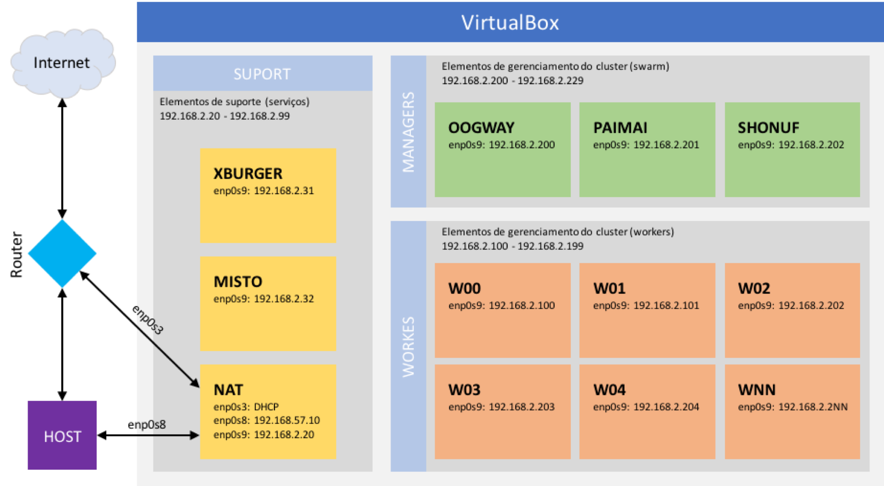

# Construção do ambiente virtual (utilizando VirtualBox)

## Desenho de rede




## Elementos de configuração

#### Acesso a internet

Não existem restrições ou características especiais para a conexão com a internet.

#### Equipamento Host

Não existem restrições ou características especiais para o equipamento utilizado.

#### VirtualBox

Utilizada a versão 5.2.12 com Oracle VM VirtualBox Extension Pack 5.2.12

#### Configuração do ambiente virtual utilizando

Para a composição da rede virtualizada utilizada uma rede interna ao VirtualBox utilizando o range 192.168.57.0/24.
Para a criação da rede interna utiliza os seguintes comandos:

`VBoxManage hostonlyif create`

Como resultado do comando foi criada a rede vboxnet1.
Para a definição dos endereçamentos e DHCP foram utilizados os seguintes comandos:

```
VBoxManage hostonlyif ipconfig vboxnet1 --ip 192.168.57.1 --netmask 255.255.255.0

VBoxManage dhcpserver add --ifname vboxnet1 --ip 192.168.57.2 --netmask 255.255.255.0 --lowerip 192.168.57.10 --upperip 192.168.56.19
VBoxManage dhcpserver modify --ifname vboxnet1 --enable
```

A definição de DHCP foi adicionado somente para a complitude do desenho da rede mas não será utilizado para esta configuração.

O comando pode variar entre maiúscula e minúscula dependendo do sistema operacional utilizado. Para a apresentação criada o sistema operacional principal foi o MacOS.

#### Configuração do servidor virtual de NAT

###### Configurações das interfaces de rede do servidor

Para criar a máquina virtual que será a centralizadora de requisições para a internet (default gateway) foi utilizada a distribuição Debian versão 9.4.0-amd64 e para manter a padronização adicionada uma máquina virtual com a distribuição CentOS versão 7 para a mesma função.

As máquinas virtuais precisam ter 3 interfaces de rede, sendo:

* Adapter 1
  - Marcado como ativo
  - Attached to: Bridge adapter
  - Name: en1:Wi-Fi (AirPort) >> neste caso para o uso da interface de rede wireless da máquina host
  - Não foram adicionadas configurações avançadas
* Adapter 2
  - Marcado como ativo
  - Attached to: Host-only adapter
  - Name: vboxnet1 >> criada anteriormente
  - Não foram adicionadas configurações avançadas
* Adapter 3
  - Marcado como ativo
  - Attached to: Internal Network
  - Name: DEB_NET >> nome usado para criar a rede interna, criado no momento da definição da interface de rede
    - Como alternativa (para o uso da distribuição CentOS) foi criada também a rede DOCKER_NET
  - Não foram adicionadas configurações avançadas

Não existem requisitos definidos para a configuração das máquinas de forma geral, somente para configuração de NETWORK e NAT.

Para a definição das placas de rede foi editado o arquivo /etc/network/interfaces (no uso de SO Debian) e incluida as seguintes definições:

```Shell
# This file describes the network interfaces available on your system
# and how to activate them. For more information, see interfaces(5).

source /etc/network/interfaces.d/*

# The loopback network interface
auto lo
iface lo inet loopback

# The primary network interface
# Configuração para obter IP do roteador/acesso de internet
auto enp0s3
allow-hotplug enp0s3
iface enp0s3 inet dhcp

# Interface de acesso entre a maquina virtual e o host
auto enp0s8
allow-hotplug enp0s8
iface enp0s8 inet static
      address 192.168.57.10
      netmask 255.255.255.0

# Interface para configuração da rede interna do virtual box
auto enp0s9
allow-hotplug enp0s9
iface enp0s9 inet static
      address 192.168.2.20
      netmask 255.255.255.0
```

## Configurações de roteamento da internet

Nesta configuração foi utiliza a ferramenta netfilter (IPTABLES) para a configuração de NAT, mascaramento de rede e encaminhamento de  requisições para internet.

Para realizar o encaminhamento de requisições, o Kernel deve ser configurado. Essa configuração pode ser realizada utilizando o comando:

`sysctl -w net.ipv4.ip_forward=1`

Ou alterar o parâmetro net.ipv4.ip_forward no arquivo /etc/sysctl.conf

### Configuração do IPTABLES


Para definir as regras de encaminhamento foi realizada a limpeza de todas as regras das tabelas do IPTABLES e adicionadas as regras de NAT e encaminhamento.

Para um melhor funcionamento do DNS, foram adicionadas as seguintes entradas no arquivo resolv.conf conforme demonstrado a seguir:

```Shell
nameserver 8.8.8.8
nameserver 8.8.4.4

nameserver 208.67.222.222
nameserver 208.67.220.220
```

E para facilitar as configurações e manter a persistência das regras de encaminhamento, foi adicionado o script [00-firewall](00-firewall) ao diretório /etc/network/if-up.d sendo que todas as vezes que a máquina reiniciar ou solicitado o inicio do serviço de netwrking o script ira realizar as configurações de forma automática.

##### Algumas fontes e referências utilizadas:
###### Configuração de redes virtuais
* [Configuração para Host-only interface](https://precisionsec.com/virtualbox-host-only-network-cuckoo-sandbox-0-4-2/)
* [Configuração de rede interna e DHCP](https://superuser.com/questions/429432/how-can-i-configure-a-dhcp-server-assigned-to-a-host-only-net-in-virtualbox)
* [Comandos do VirtualBOX para configuração de redes internas](https://thornelabs.net/2015/08/24/virtualbox-commands-cheat-sheet.html)
* [Manual do VirtualBOX para configuração de  redes](https://www.virtualbox.org/manual/ch08.html#vboxmanage-hostonlyif)

###### Configuração de NAT e mascaramento de redes internas com iptables
* [Configuração de compartilhamento de internet para a rede interna usando IPTABLES](https://debian-administration.org/article/23/Setting_up_a_simple_Debian_gateway)
